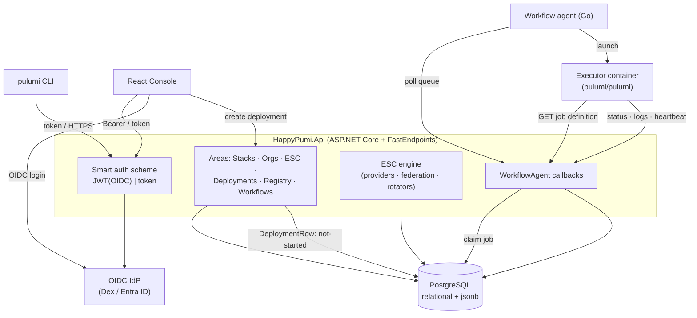
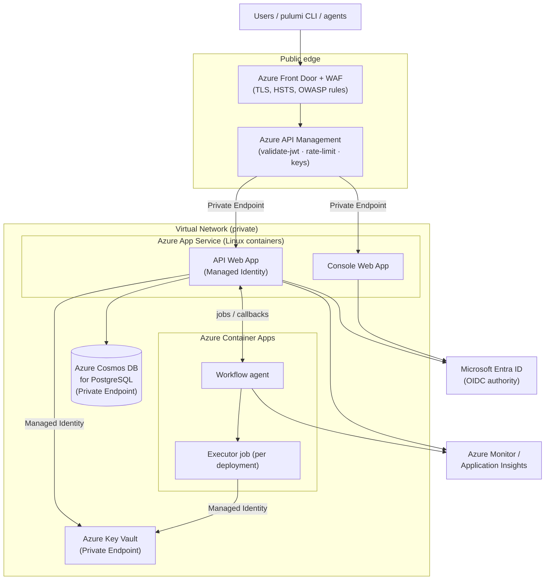

# HappyPumi — Solution Architecture & Security

**Status:** Living document · **Audience:** Solution architects & security reviewers
**Target deployment:** Microsoft Azure managed services
**Last reviewed:** 2026-06-22

> This document describes the **target Azure production architecture** for HappyPumi
> and explains its **security model in depth**. HappyPumi is a clean-room
> reimplementation of the Pulumi Cloud API (see
> [`docs/adr/0008-clean-room-implementation.md`](adr/0008-clean-room-implementation.md));
> several security mechanisms are deliberately dev-grade today, with explicit
> code-level TODOs. Those are catalogued honestly in
> [§6 Current State & Hardening Roadmap](#6-current-state--hardening-roadmap) so a
> reviewer can separate the intended posture from what ships today.

---

## 1. Executive Summary

HappyPumi is an open-source, wire-compatible reimplementation of the **Pulumi Cloud**
backend. A stock `pulumi` CLI can `login`, set config, and run the full update
lifecycle (`up` / `preview` / `refresh` / `destroy`) against it, and it adds the
Internal-Developer-Platform (IDP) surfaces: organizations & RBAC, Pulumi ESC
(Environments, Secrets, Config), a package/template registry, policy packs, and
**managed deployments** executed by a Pulumi workflow agent. A React console gives
teams a UI over the same API.

The system is built on **.NET 10 + FastEndpoints** (REPR pattern), persists all state
to **PostgreSQL** (relational columns plus `jsonb` for checkpoints/contracts) via
**EF Core 10**, and ships as a non-root Docker container.

**Target Azure deployment.** The API and console run on **Azure App Service** (Web
Apps for Containers), fronted by **Azure API Management (APIM)** as the single public
ingress. State lives in **Azure Cosmos DB for PostgreSQL**. Managed-deployment
**workflow runners** run on **Azure Container Apps**. Secrets and signing keys live in
**Azure Key Vault**, accessed through **Managed Identity**; data-plane services are
reached over **Private Endpoints** inside a VNet, with a **WAF** at the edge. Identity
is federated to **Microsoft Entra ID** via OIDC.

**Security posture in one paragraph.** Authentication is OIDC/JWT (validated against
the IdP's JWKS) plus a Pulumi CLI token scheme, dispatched by a "smart" policy scheme.
Authorization is a per-org RBAC model of 157 `resource:action` permissions surfaced as
identity claims and enforced per-endpoint. Secrets are encrypted with AES-256-GCM, and
ESC brokers **short-lived cloud credentials via OIDC federation** so long-lived cloud
keys need never be stored. Tenancy is enforced by org-scoped data access; infra-changing
actions are audited; the workflow runner is isolated, pool-token gated, and hardened
against command injection. The Azure layer adds Managed Identity, Key Vault, Private
Endpoints, WAF, and TLS everywhere.

---

## 2. System Overview & Component Map

### 2.1 Components

| Component | Technology | Role | Key paths |
|---|---|---|---|
| **HappyPumi.Api** | ASP.NET Core + FastEndpoints (.NET 10) | The API. One endpoint class per spec operation, grouped by area (Stacks, Organizations, Environments/ESC, Deployments, Registry, Workflows, WorkflowAgent, ConsoleApi, Insights). | `HappyPumi.Api/Program.cs`, area folders |
| **Console** | React 19 / Vite 8 / Tailwind 4 / TS | Web UI over `/api`; typed `fetch` client. | `console/src/lib/api.ts`, `console/src/lib/auth.ts` |
| **Persistence** | PostgreSQL + EF Core 10 | All state: stacks, updates/checkpoints, identity/RBAC, registry, policy, deployments, ESC. Relational + `jsonb`. | `HappyPumi.Api/Data/HappyPumiDbContext.cs`, `Data/Stores/Postgres*.cs` |
| **ESC engine** | C# providers over cloud SDKs | Environments, dynamic secret providers, OIDC federation, secret rotators, schedule executor, gated-open approvals. | `HappyPumi.Api/Esc/` |
| **Workflow agent** | Upstream Pulumi customer-managed agent (Go) | Polls the API for deployment jobs and launches an executor container that runs `pulumi`. Black-box product. | `customer-managed-workflow-agent/` |
| **Server-side runner callbacks** | FastEndpoints | The endpoints the agent/executor call (poll, job definition, status, logs, heartbeat). Reverse-engineered; not in the OpenAPI spec. | `HappyPumi.Api/WorkflowAgent/WorkflowAgentEndpoints.cs` |
| **Identity provider** | OIDC (Dex in dev → Entra ID in prod) | Issues id-tokens the API validates. | `HappyPumi.AppHost/dex/config.yaml` |

### 2.2 Runtime topology & managed-deployment flow

A managed deployment is enqueued as a `DeploymentRow` in state `not-started`. The agent
polls `/api/deployments/poll`, which atomically claims the oldest row, stamps a job
token, and returns a workflow definition. The agent launches an ephemeral
`pulumi/pulumi` executor that fetches its job definition, runs the requested lifecycle
operation, and streams per-step **status**, **logs**, and **heartbeats** back to the
API, which persists them for the console timeline.

---

## 3. Target Azure Architecture

### 3.1 Deployment diagram

### 3.2 Service mapping

| HappyPumi component | Azure service | Rationale & notes |
|---|---|---|
| API | **App Service (Web App for Containers)** | Runs the existing `HappyPumi.Api/Dockerfile` image (non-root, port 8080/8081). **System-assigned Managed Identity** for Key Vault & Cosmos access. **VNet integration**; no direct public ingress — reachable only via APIM/Private Endpoint. Scales out horizontally (state is in Postgres; the ESC opened-session store is per-instance — see §3.3). |
| Console | **App Service (Web App for Containers)** | Static React build served behind APIM/Front Door. OIDC Authorization-Code + PKCE against Entra ID. |
| Public ingress | **Azure API Management** | The single front door for the API. Applies `validate-jwt`, rate limiting, request-size limits, IP allow-listing, and **subscription keys** for the CLI/agent surfaces. Decompression of gzipped CLI bodies is handled by the API itself (`AddRequestDecompression()` in `Program.cs`). Backed by App Service over a Private Endpoint. |
| Edge protection | **Azure Front Door + WAF** | TLS termination, HSTS, managed certificates, OWASP/Core Rule Set, DDoS protection in front of APIM. |
| PostgreSQL | **Azure Cosmos DB for PostgreSQL** | Drop-in for the self-hosted Postgres (`ADR-0005`). EF Core 10 migrations apply unchanged for standard PostgreSQL features; validate any distributed (Citus) sharding choices against the schema. Connection via Key Vault-referenced secret **or** AAD token auth. **Private Endpoint**, encryption at rest, optional customer-managed keys (CMK). |
| Workflow runners | **Azure Container Apps** | Hosts the upstream agent and the per-deployment executor. **Design consideration:** the upstream agent normally launches nested executor containers via the **host Docker socket** (see the local demo `deploy/deployment-agent/docker-compose.yml`). Azure Container Apps exposes **no Docker socket**, so use one of: (a) **Container Apps Jobs** — one ephemeral job execution per deployment, the cleanest serverless fit; or (b) **AKS** using the agent's existing Kubernetes component (`customer-managed-workflow-agent/kubernetes/agent.ts`) when DinD-style nesting is required. Recommend **Container Apps Jobs** unless a requirement forces DinD, in which case AKS (optionally the `kubernetes-dind/` variant). |
| Identity | **Microsoft Entra ID** (or Entra External ID) | Replaces Dex as the OIDC authority. Repoint `Authentication:Oidc:Authority` and align `ValidAudiences`. App registrations for the console and CLI. |
| Secrets & keys | **Azure Key Vault** | Holds the ESC OIDC RS256 signing key, the service-managed data key, DB connection secrets, and runner secrets. Accessed via Managed Identity; no secrets in app settings. |
| Observability | **Azure Monitor / Application Insights** | The API already emits OpenTelemetry/OTLP (`ADR-0006`); point the OTLP exporter at Azure Monitor. Diagnostic logs and the audit trail flow to **Log Analytics**. |
| Networking | **VNet + Private Endpoints + NSGs** | Cosmos and Key Vault reachable only over Private Endpoints. NSGs segment App Service, Container Apps, and data subnets. App Service is not publicly exposed. |

### 3.3 Scale-out note

State is in PostgreSQL, so the API scales horizontally. One caveat for reviewers: ESC
**opened** (decrypted) environment values live only in an **in-memory per-instance
session store** (`Esc/EscSessionStore.cs`) and are never persisted. Under multiple App
Service instances behind APIM, an opened session is pinned to the instance that opened
it — enable APIM/App Service session affinity for the ESC open→read flow, or treat opens
as instance-local (the CLI/console re-open as needed).

---

## 4. Security Architecture

Each control below states the **implemented mechanism** (with file references) and **how
it lands on Azure**. Governing decisions: `ADR-0007` (OIDC + per-org RBAC), `ADR-0010`
(audit logging), `ADR-0005` (Postgres).

### 4.1 Authentication

A **"Smart" policy scheme** (`HappyPumi.Api/Program.cs`) dispatches by the `Authorization`
header: values starting with `Bearer ` go to the **JWT Bearer (OIDC)** scheme; anything
else (e.g. `token <x>`) goes to the **Pulumi token** handler. This lets the same endpoints
serve both browser (OIDC) and CLI (token) callers.

- **OIDC / JWT Bearer.** Configured when `Authentication:Oidc:Authority` is set (Dex in
  dev). Signatures are validated against the IdP's JWKS by the standard JwtBearer
  middleware; the audience is validated against `["happypumi-console", "happypumi"]`. On
  validation, `Auth/OidcClaimsEnricher.cs` resolves the role from the IdP `groups` claim
  (`happypumi-admins` → `admin`, else `member`) and injects the role's RBAC permission
  claims.
- **Pulumi CLI token scheme.** `Auth/PulumiTokenAuthHandler.cs` reads the bearer value
  from a `token ` or `Bearer ` prefix, resolves an identity, and injects permission
  claims. **Dev limitation:** any non-empty token is currently accepted and mapped to a
  seeded admin (no token store yet) — see §6.
- **ESC OIDC issuer (outbound federation).** `Esc/Oidc/EscOidcIssuer.cs` **mints** the
  API's own RS256 web-identity JWTs (RSA-2048, 60-minute lifetime) so cloud brokers
  (AWS STS, Entra, GCP STS, Vault) can verify them and exchange them for short-lived
  cloud credentials. The private key never leaves the process; only public JWKS material
  is exposed via the anonymous discovery endpoints in `Esc/Oidc/OidcDiscoveryEndpoints.cs`.
- **Agent pool tokens.** Opaque tokens gate the runner surface — see §4.7.

**On Azure:** Entra ID is the OIDC authority; APIM applies a `validate-jwt` policy as a
first gate before the request reaches App Service (defence in depth with the in-app
validation). The ESC RS256 signing key is loaded from **Key Vault** (`Esc:Oidc:PrivateKeyPem`)
rather than generated ephemerally. App Service "Easy Auth" can optionally front the
console.

### 4.2 Authorization / RBAC

- **Permission vocabulary.** `Auth/RbacPermissions.cs` defines `RbacPermissions.All` — the
  full set of **157 `resource:action`** strings across ~54 resources (e.g. `stack:read`,
  `environment:write`, `org_token:create`, `team:create_token`, `role:delete`). These were
  mined from the console, which gates UI on the same strings.
- **Role → permissions.** `RbacPermissions.ForRole(role)` grants `admin` the full set and
  any other role the read/list subset. (Persisted per-role grants are a follow-up — §6.)
- **Enforcement.** Both auth handlers stamp `permissions` claims onto the identity.
  Endpoints enforce them with FastEndpoints' `Permissions("...")` in `Configure()` (e.g.
  `Stacks/GetLatestStackResourcesEndpoint.cs` → `stack:read`). Org-management endpoints add
  the `OrgAdmin` role policy (`Auth/AuthPolicies.cs`, registered as `RequireRole("admin")`).
- **Identity persistence.** Members, roles, teams, and team-role bindings are org-scoped in
  `Data/Stores/PostgresIdentityStore.cs`.

**On Azure:** unchanged at the application layer; Entra group/role claims map onto the role
resolution. Azure RBAC separately governs the *control plane* (who can manage the App
Service, Cosmos, Key Vault) — distinct from HappyPumi's application RBAC.

### 4.3 Secrets management

- **Service-managed value encryption.** `Secrets/AesValueCrypter.cs` implements
  **AES-256-GCM** (AEAD; layout `nonce(12) || tag(16) || ciphertext`, base64). It backs the
  `/encrypt`, `/decrypt`, and batch endpoints the CLI calls for the service-managed secrets
  provider. **Dev limitation:** the data key is process-static (regenerated per run, no KMS)
  — see §6.
- **ESC engine** (`Esc/`). `EscOpener.cs` resolves an environment (imports, deep-merge of
  `values`, `fn::open::<provider>` evaluation, interpolation, `fn::secret`). Opened/decrypted
  values live only in the in-memory session store — never persisted.
  - **Dynamic secret providers** (`fn::open`): Azure Key Vault, AWS Secrets Manager, AWS SSM
    Parameter Store, GCP Secret Manager, HashiCorp Vault KV v2, and cross-stack Pulumi Stacks
    (`Esc/Providers/`).
  - **Login providers** (`fn::open::aws-login` / `azure-login` / `gcp-login` / `vault-login`):
    prefer **OIDC federation** — e.g. `Esc/Providers/Logins/Aws/AwsLoginProvider.cs` mints a
    web-identity token via the ESC OIDC issuer and calls STS `AssumeRoleWithWebIdentity` for
    short-lived credentials, so **no long-lived secret is stored**. Static credentials are
    supported but flagged `Secret: true`.
  - **Secret rotators** (`fn::rotate`): AWS IAM keys, PostgreSQL and MySQL passwords; rotation
    history is persisted and rotations are audited.
  - **Gated open / approval workflow** (`Esc/EscOpenGate.cs`): an environment matching an org
    `ApprovalRule` glob can only be opened by a principal holding an active, unexpired grant
    from the open-request → approve flow; the strictest matching rule's `RequiredApprovals`
    applies. This is the enforcement point for sensitive-secret access.

**On Azure:** the AES data key, ESC signing key, DB connection secret, and runner secrets all
move to **Key Vault**, retrieved via **Managed Identity** (no secrets in config). Cosmos
supports CMK for envelope encryption. The ESC Azure provider authenticates to Key Vault with
the same Managed Identity.

### 4.4 Multi-tenancy / organization isolation

Tenancy is enforced at the **data-access layer**: every Postgres store filters on the `Org`
column, and single-row lookups combine the id with the org (e.g. `r.Id == id && r.Org == org`)
to prevent cross-tenant id guessing. Verified across `PostgresIdentityStore`, `PostgresAuditLog`,
`PostgresAgentPoolStore`, and the ESC stores.

**Known defence-in-depth gap (for reviewers):** the org name comes from the route/request DTO,
and there is no observed cross-check that the authenticated principal is a member of that org.
Isolation currently relies on query scoping plus RBAC where applied. Combined with the dev-mode
token handler (§6), this is a gap to close before production — add a principal↔org membership
check in a shared filter.

### 4.5 Transport security

- **HTTPS** end to end. Dev/test use the self-signed ASP.NET Core dev cert (`ADR-0007`); the
  API container exposes 8080/8081.
- **Security response headers** are attached in `Program.cs` via `OnStarting` (so they apply to
  error responses too): `X-Content-Type-Options: nosniff`, `X-Frame-Options: DENY`,
  `Referrer-Policy: no-referrer` (OWASP A05).
- **CORS** is dev-only and gated behind the `AllowCorsAll` flag (reflects origin + credentials);
  it must remain off in production.

**On Azure:** TLS terminates at Front Door and re-encrypts to APIM and App Service; **HSTS** and
managed certs at the edge; the **WAF** adds OWASP rule coverage. Add a **Content-Security-Policy**
for the console (not currently emitted — §6). CORS stays disabled; same-origin via APIM removes
the need for it.

### 4.6 Audit logging (ADR-0010)

`State/IAuditLog.cs` defines `Record(org, event, description, actor)` / `List(org)`;
`Data/Stores/PostgresAuditLog.cs` writes an org-scoped, timestamped, newest-first trail. It is
recorded at infra-changing endpoints — team/service creation, change-request approve/unapprove,
and ESC create/update/delete/open/rotate. The actor is derived from the principal (`Auth/RequestActor.cs`),
defaulting to `happypumi`.

**On Azure:** ship the audit trail and diagnostic logs to **Log Analytics**, optionally mirrored to
**immutable (WORM) storage** for tamper-evidence, with **Microsoft Defender for Cloud** alerting.
**Caveats (for reviewers):** ADR-0010 envisions a fail-closed pluggable blob sink; the implemented
sink is Postgres, and coverage is limited to the handful of endpoints above — broadening coverage is
a roadmap item (§6).

### 4.7 Workflow runner security

The runner is the **upstream Pulumi customer-managed workflow agent** (black box). HappyPumi
implements only the server endpoints it calls (`WorkflowAgent/WorkflowAgentEndpoints.cs`).

- **Pool-token gate.** `Auth/AgentPoolTokenMiddleware.cs` runs *before* authentication and protects
  `/api/background-activities`, `/api/deployments/poll`, and `/api/deployments/executor`. It requires
  `Authorization: token <pool-token>`, validated via `IAgentPoolStore.FindByToken`; unknown/missing →
  401. Pool tokens are opaque (`"pul-" + two GUIDs`). Job-scoped `/api/workflow/jobs/*` are reached
  only after a pool-authenticated poll and use the server-minted **job token**.
- **Command-injection hardening (OWASP A03).** `BuildJob`/`DeployScript` interpolate org/project/stack
  and template-ref segments into a bash script; every segment must pass `RequireSafeIdentifier`
  (`^[A-Za-z0-9._+-]+$`), rejecting quotes/whitespace/`/`/shell metacharacters, with single-quoting as
  belt-and-suspenders. The script uses `set -euo pipefail`, a fixed private workdir, and avoids command
  substitution.
- **Defensive callback parsing.** Status/logs/heartbeat endpoints parse bodies manually (no assumed
  Content-Type).
- **Least-privilege isolation (k8s variant).** `customer-managed-workflow-agent/kubernetes/agent.ts`
  gives the agent a dedicated ServiceAccount and a namespaced Role limited to `pods`, `pods/log`, and
  `configmaps`; the agent token is a k8s Secret; release artifacts are cosign-signed.

**On Azure:** run the agent/executor on **Container Apps** (Jobs) or **AKS** (§3.2) with a **Managed
Identity** scoped to only what a deployment needs, **no host Docker socket**, and per-job ephemeral
execution. The hardcoded executor passphrase (§6) is replaced by a per-job secret from Key Vault.

### 4.8 State / checkpoint encryption

Pulumi state and checkpoints persist as `jsonb` in PostgreSQL (`ADR-0005`). The CLI encrypts secret
config/outputs **client-side** before they reach the checkpoint, and the service-managed crypter
(§4.3) backs the `/encrypt`/`/decrypt` endpoints — so secret values inside checkpoints are
AES-256-GCM ciphertext.

**On Azure:** Cosmos for PostgreSQL provides **encryption at rest** (with optional CMK), and the
service-managed key moves to Key Vault, closing the ephemeral-key gap (§6).

### 4.9 Azure-native platform controls (summary)

- **Managed Identity** for all service-to-service auth (App Service → Cosmos/Key Vault; runner → Key Vault); no secrets in config.
- **Private Endpoints** for Cosmos and Key Vault; **NSGs** segment subnets; App Service not publicly exposed.
- **WAF** (Front Door) + **APIM** policies (JWT validation, rate limiting, IP allow-list, subscription keys).
- **Defender for Cloud** for posture management and threat alerts; **Azure Policy** for guardrails.
- **Azure RBAC** governs the control plane, distinct from HappyPumi application RBAC.
- **Log Analytics / App Insights** for diagnostics and the audit trail.

---

## 5. Networking & Data Flow Summary

1. A user/CLI/agent request hits **Front Door (WAF)** → **APIM**.
2. APIM validates the JWT (or subscription key for agent/CLI surfaces), applies rate limits, and forwards over a **Private Endpoint** to the API or console App Service.
3. The API authenticates again in-process (smart scheme), authorizes via RBAC permission claims, and reads/writes **Cosmos DB for PostgreSQL** over a Private Endpoint, scoping every query by org.
4. For secrets, the API uses **Managed Identity** to read keys from **Key Vault**, and for ESC brokers short-lived cloud credentials via OIDC federation.
5. For a managed deployment, the API enqueues a job; a **Container Apps** runner (pool-token gated) claims it and runs `pulumi`, streaming status/logs/heartbeats back.
6. Telemetry and audit events flow to **Azure Monitor / Log Analytics**.

---

## 6. Current State & Hardening Roadmap

HappyPumi is correctly *shaped* for production security, but several pieces are intentionally
dev-grade with code-level TODOs. The following must be closed before a production Azure deployment.

| # | Current state (dev-grade) | Where | Production fix on Azure |
|---|---|---|---|
| 1 | Any non-empty CLI token is accepted and mapped to a seeded admin (no token store). | `Auth/PulumiTokenAuthHandler.cs` | Real personal-access-token store; Entra-issued tokens; validate against the store. |
| 2 | RBAC is a hardcoded admin/member split; no persisted per-role grants. | `Auth/RbacPermissions.cs` | Persist per-role permission grants; resolve from stored role. |
| 3 | AES data key is process-static (regenerated per run, lost on restart, no KMS). | `Secrets/AesValueCrypter.cs` | Key Vault-backed key (optionally per-stack derived); envelope encryption. |
| 4 | `RequireHttpsMetadata=false`; permissive reflected CORS (dev only). | `Program.cs` | Enforce HTTPS metadata against Entra; keep CORS disabled (same-origin via APIM). |
| 5 | Executor uses a hardcoded `PULUMI_CONFIG_PASSPHRASE="hp-demo"`. | `WorkflowAgent/WorkflowAgentEndpoints.cs` | Per-job secret from Key Vault, injected to the runner. |
| 6 | Most endpoints still call `AllowAnonymous()` (generator stubs; an endpoint "isn't done while anonymous"). | area folders | Replace stubs with real `Permissions(...)`/policy per `ADR-0007`. |
| 7 | No principal↔org membership cross-check; org comes from the route. | Postgres stores | Add a shared filter asserting the caller is a member of the route's org. |
| 8 | Audit coverage limited to a few endpoints; sink is Postgres, not the ADR-0010 fail-closed blob sink. | `Data/Stores/PostgresAuditLog.cs` | Broaden coverage to all mutating actions; ship to Log Analytics + immutable storage. |
| 9 | No HSTS / Content-Security-Policy header emitted by the app. | `Program.cs` | Add CSP for the console; HSTS at Front Door/App Service. |
| 10 | Runner relies on host Docker socket for nested executors. | `deploy/deployment-agent/docker-compose.yml` | Container Apps Jobs (no socket) or AKS; per-job isolation + Managed Identity. |

---

## 7. Appendix

### 7.1 Key file reference index

- **API host & config:** `HappyPumi.Api/Program.cs`, `HappyPumi.Api/Dockerfile`, `appsettings*.json`
- **Auth:** `Auth/PulumiTokenAuthHandler.cs`, `Auth/OidcClaimsEnricher.cs`, `Auth/AuthPolicies.cs`, `Auth/RbacPermissions.cs`, `Auth/AgentPoolTokenMiddleware.cs`, `Auth/RequestActor.cs`
- **Secrets / ESC:** `Secrets/AesValueCrypter.cs`, `Secrets/IValueCrypter.cs`, `Esc/EscOpener.cs`, `Esc/EscOpenGate.cs`, `Esc/EscSessionStore.cs`, `Esc/Oidc/EscOidcIssuer.cs`, `Esc/Oidc/OidcDiscoveryEndpoints.cs`, `Esc/Providers/`, `Esc/Rotators/`
- **Data:** `Data/HappyPumiDbContext.cs`, `Data/Stores/Postgres*.cs`, `State/I*.cs`, `Data/Migrations/`
- **Runner:** `WorkflowAgent/WorkflowAgentEndpoints.cs`, `Deployments/PollDeploymentsQueueEndpoint.cs`, `deploy/deployment-agent/docker-compose.yml`, `customer-managed-workflow-agent/kubernetes/agent.ts`
- **Console:** `console/src/lib/api.ts`, `console/src/lib/auth.ts`, `console/vite.config.ts`
- **Local orchestration:** `HappyPumi.AppHost/AppHost.cs`, `HappyPumi.AppHost/dex/config.yaml`, `compose.yaml`

### 7.2 ADR cross-references

`docs/adr/0001` (.NET 10) · `0002` (FastEndpoints/REPR) · `0004` (Docker packaging) ·
`0005` (PostgreSQL) · `0006` (OpenTelemetry) · `0007` (OIDC + RBAC) · `0008` (clean-room) ·
`0009` (GitHub & Azure DevOps VCS) · `0010` (audit logging).

### 7.3 Glossary

- **ESC** — Pulumi Environments, Secrets, and Config: composable environments that resolve secrets and broker cloud credentials.
- **REPR** — Request-Endpoint-Response pattern (FastEndpoints): one endpoint class per operation.
- **OIDC federation** — exchanging a minted web-identity JWT for short-lived cloud credentials, avoiding stored long-lived keys.
- **Agent pool** — a registered set of workflow agents authorized (via a pool token) to claim deployment jobs.
- **Executor** — the ephemeral container that actually runs `pulumi up/preview/refresh/destroy` for a managed deployment.
- **Checkpoint** — the serialized stack state Pulumi persists during an update (stored as `jsonb`).
